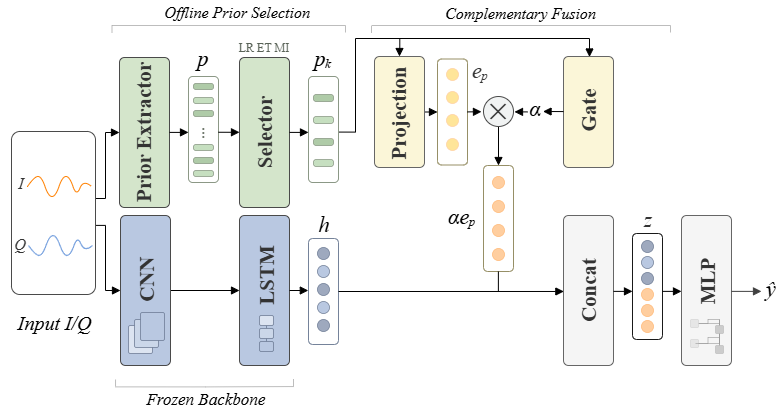

# DPS-CF

Reference repository for **Decoupled Prior Selection and Complementary Fusion for Automatic Modulation Classification (DPS-CF)**.

DPS-CF separates two operations that are often coupled in prior-assisted automatic modulation classification (AMC):

1. **Scenario-level prior selection** from a broad deterministic candidate pool.
2. **Sample-level complementary fusion** of the selected priors with a frozen deep I/Q representation.

The selector combines sparse logistic regression (LR), ExtraTrees (ET), and mutual information (MI). The selected Top-\(k\) priors are projected to a compact embedding, rescaled by a sample-wise scalar gate, and concatenated with a pretrained CNN-LSTM representation.

> This repository is a compact reference release for the accompanying paper. It documents the method structure, the common 98-dimensional prior pool, the selected Top-24 subsets, and the USRP data-construction protocol. It does **not** include the complete training/evaluation pipeline, pretrained checkpoints, internal data loaders, experiment orchestration code, or raw datasets.

## Framework

Place the final architecture figure at:

```text
assets/dps_cf_framework.png
```

The README will display it automatically after the file is added:



## Method overview

Given an I/Q sample \(x\), a pretrained CNN-LSTM backbone produces a 128-dimensional representation \(h\). In parallel, a deterministic extractor constructs a 98-dimensional candidate-prior vector.

The prior selector operates offline on training-set prior vectors and labels:

```text
98-D candidate prior pool
        │
        ├── sparse LR
        ├── ExtraTrees
        └── mutual information
                │
        criterion normalization
                │
        equal-weight aggregation
                │
              Top-k
                │
          selected priors
```

For the reported experiments, \(k=24\). The selected vector is processed by two parallel branches:

```text
Projection: 24 → 64 → 64
Gate:       24 → 32 → 1 → sigmoid
```

The gate output $\alpha$ rescales the projected prior embedding $e_p$. The final representation is

$$
z = [h; \alpha e_p],
$$

with $h \in \mathbb{R}^{128}$ and $e_p \in \mathbb{R}^{64}$. The fused 192-dimensional representation is classified by a

$$
192 \rightarrow 256 \rightarrow 128 \rightarrow C
$$

MLP. During fusion training, the CNN-LSTM backbone remains frozen.

## Common 98-dimensional prior pool

Both the self-built USRP dataset and RML2018.01A use the **same 98-dimensional candidate pool**:

| Component | Dimensions |
|---|---:|
| Base physical/statistical descriptors | 38 |
| Higher-order cumulant/statistical descriptors | 13 |
| Extended statistics | 47 |
| **Total** | **98** |

The complete dimension ordering and definitions are listed in [`docs/PRIOR_POOL.md`](docs/PRIOR_POOL.md).

The final Top-24 selections are provided in:

- [`metadata/selected_priors_usrp.json`](metadata/selected_priors_usrp.json)
- [`metadata/selected_priors_rml2018.json`](metadata/selected_priors_rml2018.json)

Selection is performed independently for the two datasets.

## Datasets

### Self-built USRP OTA dataset

The primary dataset contains 13 modulation classes collected in a short-range laboratory environment using two USRP B210 devices. High-SNR OTA recordings are augmented offline with controlled AWGN to form SNR levels from -10 to 20 dB in 2-dB steps.

Detailed acquisition and partitioning information is provided in [`docs/DATASET_USRP.md`](docs/DATASET_USRP.md).

**Data availability:** The self-built USRP OTA dataset is available from the authors upon reasonable request.

### RML2018.01A

RML2018.01A contains 2,555,904 examples from 24 modulation classes with SNRs from -20 to 30 dB in 2-dB steps. Each example is a \(2*1024\) I/Q sequence. A fixed class-SNR-stratified split assigns approximately half of the samples to training and half to testing; validation data are drawn from the training portion.

This repository does not redistribute RML2018.01A.

## Reference code

The [`src`](src/) directory contains intentionally compact method-level reference code:

- `dps_cf.py` — projection, scalar gate, fusion classifier, and backbone interface.
- `selector.py` — LR/ET/MI scoring, normalization, equal-weight aggregation, and Top-\(k\) selection.
- `prior_extractor_reference.py` — prior-pool organization and extraction interface.

These files are **not an end-to-end reproduction package**. In particular, the internal backbone implementation, complete production prior extractor, data loading, training loop, checkpoint handling, and evaluation pipeline are omitted.

## Configuration

The principal architecture and optimization settings reported in the paper are summarized in [`configs/dpscf_config.yaml`](configs/dpscf_config.yaml).

## Repository structure

```text
DPS-CF/
├── README.md
├── assets/
│   └── dps_cf_framework.png
├── docs/
│   ├── DATASET_USRP.md
│   └── PRIOR_POOL.md
├── configs/
│   └── dpscf_config.yaml
├── metadata/
│   ├── selected_priors_usrp.json
│   └── selected_priors_rml2018.json
└── src/
    ├── dps_cf.py
    ├── selector.py
    └── prior_extractor_reference.py
```


## Copyright

Copyright © 2026 Zuotao Zheng. All rights reserved.

No open-source license is granted by this repository.
